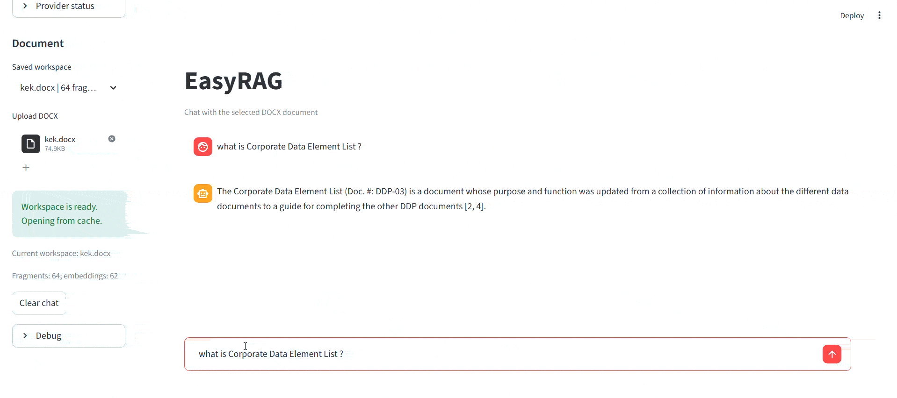

# EasyRAG

Local-first RAG for DOCX documents with exact search, BM25, hybrid retrieval, multimodal formula extraction, and a Streamlit chat UI.


EasyRAG turns a DOCX file into a local searchable workspace, caches parsed fragments and embeddings, and answers questions through a chat interface.

It is designed for structured documents where plain vector search is not enough:

- regulatory and banking documents
- internal procedures and manuals
- technical documentation
- DOCX files with tables, formulas, and embedded Word objects

## Demo



## Why EasyRAG

EasyRAG is built around a practical retrieval stack rather than a single LLM call.

- **Exact search** catches codes, norms, account numbers, and literal fragments
- **BM25** improves lexical recall for structured prose
- **Hybrid retrieval** adds embedding-based semantic search where it helps
- **Deterministic answer builders** handle norms, terms, composition questions, and code lookups
- **Vision-based formula extraction** handles DOCX formulas stored as images
- **Local workspace caching** avoids reparsing and reembedding on every launch

## What It Does

- Parses DOCX paragraphs and tables into searchable records
- Builds a per-document workspace with cached records, embeddings, and assets
- Lets you choose answer, embedding, and vision models separately
- Extracts formula text from embedded images using a multimodal model
- Shows relevant formula images inline in answers when needed
- Handles questions like:
  - `How is the H2 ratio calculated?`
  - `What is included in Lat?`
  - `What does code 8720 mean?`
  - `Where is Lam described in the document?`

## Formula Pipeline

EasyRAG no longer uses local OCR or `pix2tex`.

Current formula flow:

1. DOCX parsing extracts embedded formula images and saves them as workspace assets
2. If a vision-capable model is available, EasyRAG sends the image to that model
3. Recognized formula text is added back into the search index
4. If recognition is unavailable, the image asset is still preserved and can be shown in the answer

Important notes:

- many regulatory DOCX files store formulas as `WMF` or `EMF`
- on Windows, EasyRAG renders those vector objects through PowerPoint before recognition
- if Microsoft Office / PowerPoint is not installed, some `WMF` / `EMF` formulas may not be rendered or previewed correctly

## Quick Start

### Option 1: Portable Python

```powershell
bootstrap_env.bat
copy .env.example .env
start_app.bat
```

Then open:

- `http://localhost:8501`

### Option 2: venv

```powershell
python -m venv .venv
.\.venv\Scripts\Activate.ps1
python -m pip install -r requirements.txt
powershell -ExecutionPolicy Bypass -File scripts\run_streamlit.ps1
```

### Option 3: System Python

```powershell
python -m pip install -r requirements.txt
powershell -ExecutionPolicy Bypass -File scripts\run_streamlit.ps1
```

## Requirements

- Windows
- Python 3.11+
- Microsoft Office / PowerPoint recommended for `WMF` / `EMF` formulas
- Ollama or OpenRouter if you want LLM / embedding / vision inference

## Recommended Flow

If you want the default EasyRAG experience, start here:

1. Upload one DOCX file in the sidebar
2. Pick the answer model
3. Pick the embedding model
4. Pick the vision model, or leave it as `None`
5. Ask questions in natural language

Recommended query patterns:

- `How is the H3 ratio calculated?`
- `What is included in Lam?`
- `What is Ovt*?`
- `Which codes are used in the Lat calculation?`

## Model Selection

EasyRAG supports separate model roles in the UI:

- **Answer model**: used for generation
- **Embedding model**: used for semantic retrieval
- **Vision model**: used for formula extraction from images

Behavior when no vision model is selected:

- the UI defaults to `None`
- EasyRAG tries to use the selected answer model as the vision model if that model supports image input

## Configuration

Start from `.env.example`:

```env
APP_ENV=dev
APP_HOST=0.0.0.0
APP_PORT=8501
APP_LANGUAGE=ru
LLM_PROVIDER=openrouter

OLLAMA_BASE_URL=http://10.32.2.36:11434
OLLAMA_DEFAULT_MODEL=gemma4:26b
OLLAMA_DEFAULT_EMBED_MODEL=qwen3-embedding:8b
OLLAMA_DEFAULT_VISION_MODEL=
OLLAMA_TAGS_PATH=/api/tags
OLLAMA_PS_PATH=/api/ps
OLLAMA_CONTROL_TIMEOUT_SECONDS=2
OLLAMA_INFERENCE_TIMEOUT_SECONDS=300

OPENROUTER_API_KEY=
OPENROUTER_BASE_URL=https://openrouter.ai/api/v1
OPENROUTER_MODEL=google/gemma-4-26b-a4b-it
OPENROUTER_EMBED_MODEL=qwen/qwen3-embedding-8b
OPENROUTER_VISION_MODEL=

EMBEDDING_BATCH_SIZE=16
EMBEDDING_RECORD_TYPES=paragraph,table_row
VECTOR_BACKEND=local
VECTOR_COLLECTION=easyrag_chunks
RERANKER_ENABLED=false
TRACE_AGENT_STEPS=true
```

Notes:

- `APP_LANGUAGE` supports `ru` and `en`
- `EMBEDDING_RECORD_TYPES=paragraph,table_row` is the default because exact/BM25 already covers many table questions well
- `OLLAMA_DEFAULT_VISION_MODEL` and `OPENROUTER_VISION_MODEL` are optional

## Retrieval Strategy

EasyRAG does not treat every question the same way.

- **Norm questions** like `H2`, `H3`, `H4` use intent-aware retrieval with paragraph anchoring
- **Composition questions** like `what is included in Lat` prefer deterministic extraction from nearby definitions
- **Code lookups** prefer exact/table-oriented retrieval
- **General questions** can use hybrid retrieval with embeddings

This matters because structured documents are not uniform:

- a Python codebase README is retrieved differently from
- a journalistic article, which is retrieved differently from
- a banking regulation full of formulas, codes, and account lists

## Current UI Behavior

- answer model, embedding model, and vision model are selected separately in the sidebar
- there are no extra custom-model input fields in the current UI
- formula images are shown only for locally relevant norm/formula answers
- deterministic term/composition answers intentionally do not auto-attach unrelated formula images

## Project Layout

```text
app/
  agents/       retrieval orchestration and deterministic answer builders
  core/         config, i18n, shared models
  ingestion/    DOCX parsing and formula processing
  providers/    Ollama / OpenRouter integrations
  retrieval/    exact, BM25, hybrid, vector logic
  storage/      workspaces, embeddings, assets, conversations
  ui/           Streamlit application
scripts/        startup and helper scripts
tools/          portable Python runtime
```

## Commands

```powershell
tools\python-portable\python.exe scripts\provider_status.py
powershell -ExecutionPolicy Bypass -File scripts\run_streamlit.ps1
```

## Notes

- `requirements.txt` intentionally lists only the direct Python dependencies used by the project
- some functionality depends on Windows system capabilities rather than extra pip packages
- formula rendering for Office vector formats is a runtime/system concern, not a Python dependency concern
